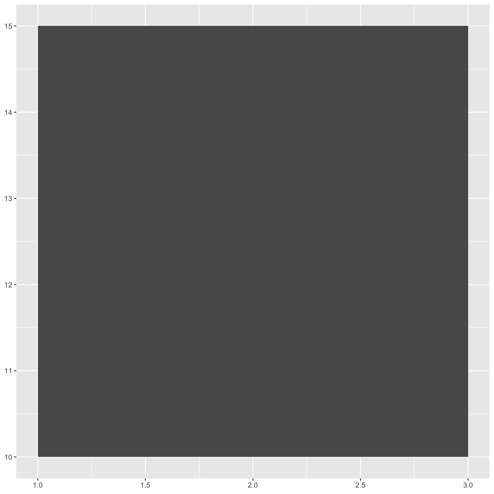
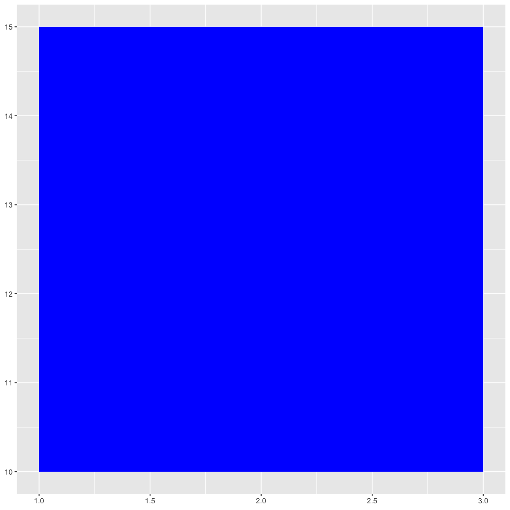
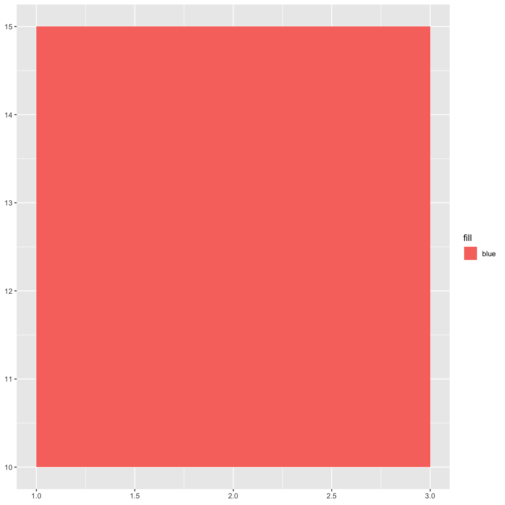
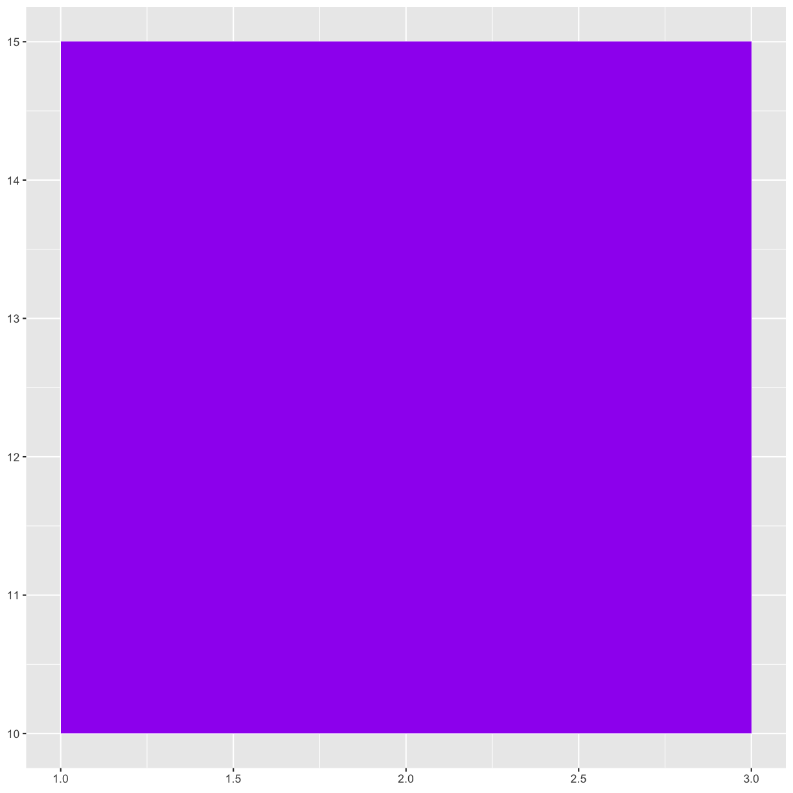
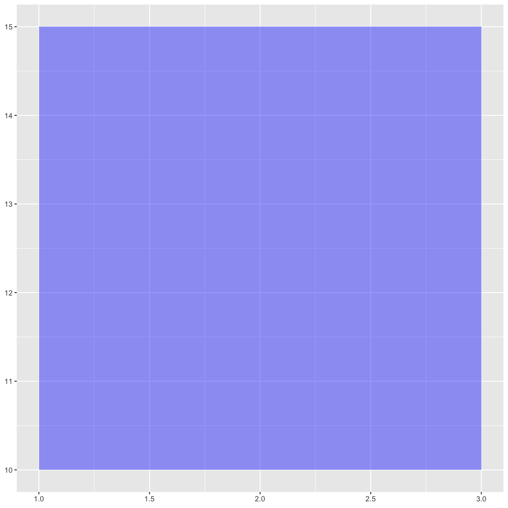
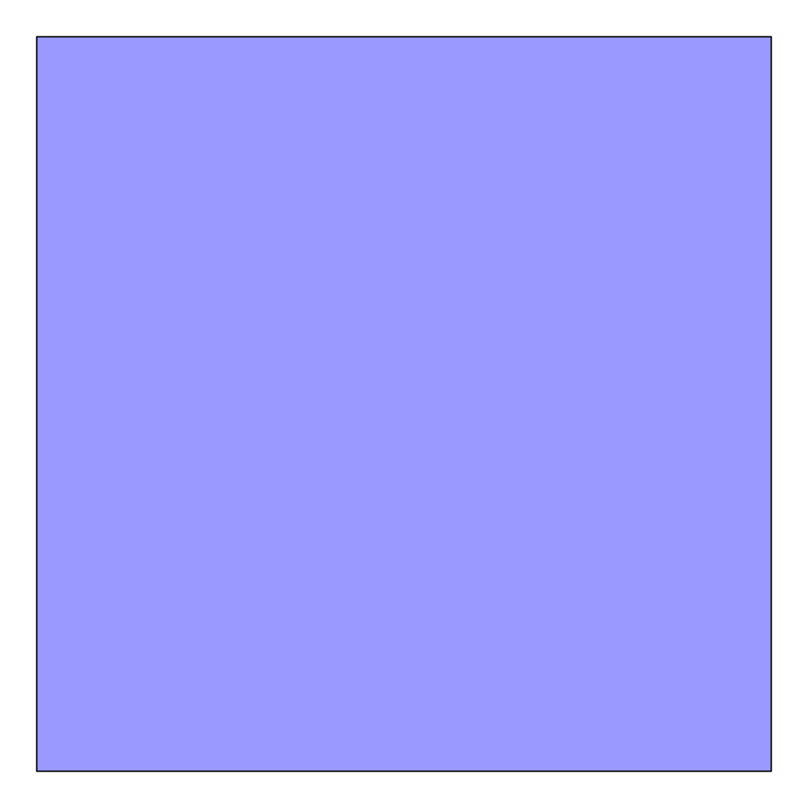
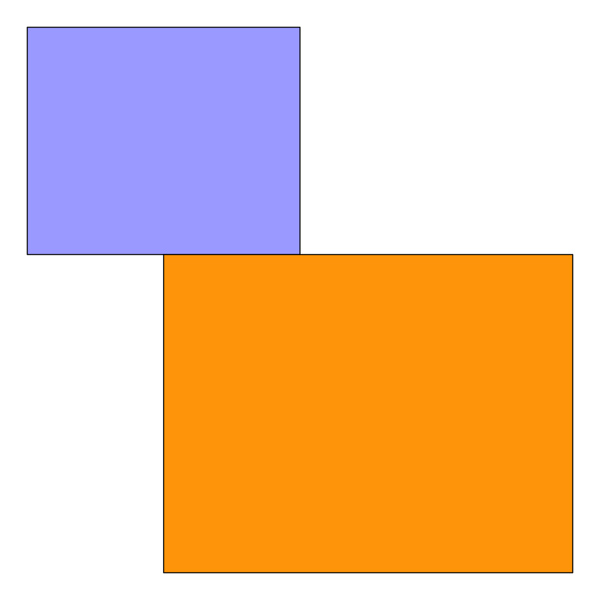

---
# Please do not edit this file directly; it is auto generated.
# Instead, please edit 01-introduction.md in _episodes_rmd/
title: "Draw a Rectangle"
teaching: 0
exercises: 0
questions:
- "How do I draw a rectangle?"
objectives:
- "Create rectangles using ggplot2."
- "Set aesthetics (e.g. color, opacity) of drawn object."
keypoints:
- "First key point. Brief Answer to questions. (FIXME)"
---

~~~
library(ggplot2)
~~~
{: .language-r}

~~~
ggplot() + 
  geom_rect(aes(xmin = 1, xmax = 3, ymin = 10, ymax = 15))
~~~
{: .language-r}

~~~
ggplot() + 
  geom_rect(aes(xmin = 1, xmax = 3, ymin = 10, ymax = 15), 
            fill = "blue")
~~~
{: .language-r}

## Warning

~~~
ggplot() + 
  geom_rect(aes(xmin = 1, xmax = 3, ymin = 10, ymax = 15, fill = "blue"))
~~~
{: .language-r}

> ## Your Favorite Color
> 
> 
> ~~~
> ggplot() + 
> geom_rect(aes(xmin = 1, xmax = 3, ymin = 10, ymax = 15), fill = "purple")
> ~~~
> {: .language-r}
> 
> 
>
{: .challenge}

~~~
ggplot() + 
  geom_rect(aes(xmin = 1, xmax = 3, ymin = 10, ymax = 15), 
            fill = "blue", alpha = 0.4)
~~~
{: .language-r}

Higher alpha is more opaque (less transparent). 

~~~
ggplot() + 
  geom_rect(aes(xmin = 1, xmax = 3, ymin = 10, ymax = 15), 
            fill = "blue", alpha = 0.4, color = "black")
~~~
{: .language-r}

~~~
ggplot() + 
  geom_rect(aes(xmin = 1, xmax = 3, ymin = 10, ymax = 15), 
            fill = "blue", alpha = 0.4, color = "black") + 
  theme_void()
~~~
{: .language-r}

~~~
ggplot() + 
  geom_rect(aes(xmin = 1, xmax = 3, ymin = 10, ymax = 15), 
            fill = "blue", alpha = 0.4, color = "black") + 
  geom_rect(aes(xmin = 2, xmax = 5, ymin = 3, ymax = 10), 
            fill = "orange", alpha = 1, color = "black") +
  theme_void()
~~~
{: .language-r}

Possible to add each rectangle with a separate line of code (i.e. a separate
call to the `geom_rect()` function), but labor intensive and repetitive.
Instead, we can create a table-like data structure to hold the values we want
to use for each rectangle and iterate through each row of that table with
a single line of code. 



