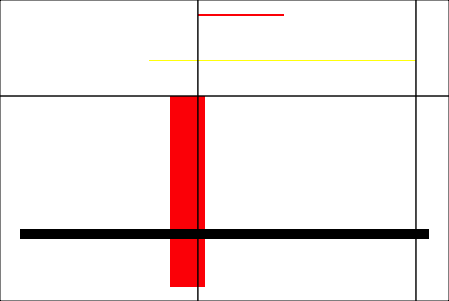
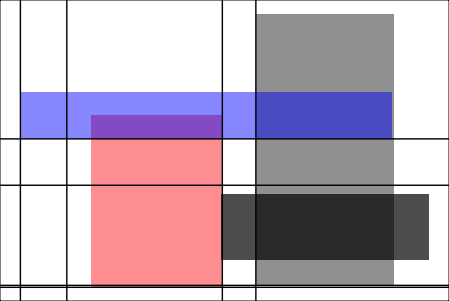
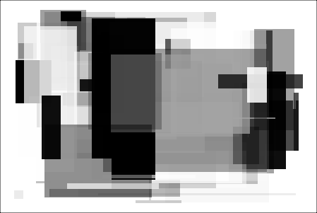

Lesson in initial assembly phase. This is meant to eventually be a fun introduction to ggplot through an artistic project - creating randomized Mondrian-style art. 

<!-- this is an html comment -->

 This is a comment in Liquid 

> ## Prerequisites
>
> FIXME
{: .prereq}



By the end of this lesson, you will be able to create cool semi-random Mondrian-inspired digital paintings like this:

You will understand how to customize individual features of your plots, and change things like color scheme:

transparency:

and density of borders:

You will also be able to . . . 
